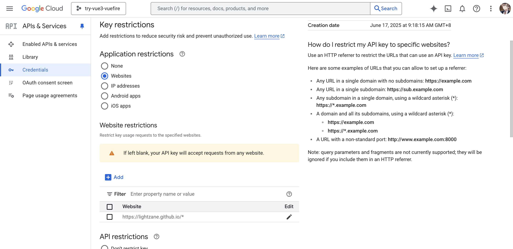

# try-vue3-vuefire  

Discovering **VueFire** (https://vuefire.vuejs.org/) while studying the related course: https://www.vuemastery.com/courses/firebase-with-vue3-and-vuefire/firebase-fundamentals

**YOU MUST HAVE** an existing **Firebase** account, and create a **Cloud Firestore Database**.

## Learn and Review

- Firebase ([_Cloud Firestore Database_](https://firebase.google.com/docs/firestore))
- VueFire
- Vite environment ([.env.example](./.env.example)) - See [Vite Docs](https://vite.dev/guide/env-and-mode.html#env-variables)
- Vuetify (https://vuetifyjs.com/en/getting-started/installation/#existing-projects)
- Firebase Authentication (https://console.firebase.google.com/project/try-vue3-vuefire/authentication/providers)

## How this project was created

`npm create vue`

```bash
> npx
> create-vue

┌  Vue.js - The Progressive JavaScript Framework
│
◇  Project name (target directory):
│  try-vue3-vuefire
│
◇  Select features to include in your project: (↑/↓ to navigate, space to select, a to toggle all, enter to confirm)
│  TypeScript

Scaffolding project in /Users/lightzane/Documents/dev/try-vue3-vuefire...
│
└  Done. Now run:

   cd try-vue3-vuefire
   npm install
   npm run dev

| Optional: Initialize Git in your project directory with:

   git init && git add -A && git commit -m "initial commit"
```

## Install Dependencies

### VueFire and Firebase

> Note: YOU MUST HAVE an existing **Firebase** account and create a **Cloud Firestore Database**

https://vuefire.vuejs.org/guide/getting-started.html#Installation

```bash
npm i vuefire firebase
```

## Cleanup Boilerplate

**To follow the course** copy the few key codes: https://github.com/Code-Pop/firebase-with-vue-3-and-vuefire/tree/02-begin

## Note on Errors

### Cannot find module

When you experience cannot find module on .vue components

```vue
<!-- CafeCard.vue -->
<script setup lang="ts">
import { computed } from 'vue';
import BaseButton from '@/components/base/BaseButton.vue'; // if this has error
</script>
```

Then double check that the **`BaseButton.vue`** file must also have `lang="ts"` in its `<script setup>`

## Authentication

Firebase Docs: https://firebase.google.com/docs/auth/web/start

VueFire Docs: https://vuefire.vuejs.org/guide/auth.html

### Cloud Firestore Rules

https://firebase.google.com/docs/firestore/security/rules-conditions#data_validation

```text
rules_version = '2';

service cloud.firestore {
  match /databases/{database}/documents {
    match /{document=**} {
      // allow read, write: if false;
      // allow read, write: if request.time < timestamp.date(2025, 6, 30);
      allow update, delete: if request.auth != null && request.auth.uid == resource.data.createdById; // after resource.data is arbitrary
      allow create: if request.auth != null;
      allow read: if true;
    }
  }
}
```

### API Restrictions

> Since Firebase keys are public in client, you can restrict API usage

1. Go to https://console.cloud.google.com
2. Select project or organization (e.g. `try-vue3-vuefire` - Firebase will also automatically create a Google Cloud for your Firebase project)
3. Select **APIs & Services**
4. Select **Credentials**
5. Configure **Application restrictions** based on the use-case

_DO NOT FORGET_ to press the **Save** button at the bottom part of the page.



#### IMPORTANT

Also, include your **Firebase Auth Domain** (i.e. `https://try-vue3-vuefire.firebaseapp.com`)

If not, then you will get the following error:

```json
{
  "error": {
    "code": 403,
    "message": "Requests from referer https://try-vue3-vuefire.firebaseapp.com/ are blocked."
  }
}
```

Also, you may want to include the domain (i.e. `https://lightzane.github.io`) in **OAuth 2.0 Client IDs**

## Recommended IDE Setup

[VSCode](https://code.visualstudio.com/) + [Volar](https://marketplace.visualstudio.com/items?itemName=Vue.volar) (and disable Vetur).

## Type Support for `.vue` Imports in TS

TypeScript cannot handle type information for `.vue` imports by default, so we replace the `tsc` CLI with `vue-tsc` for type checking. In editors, we need [Volar](https://marketplace.visualstudio.com/items?itemName=Vue.volar) to make the TypeScript language service aware of `.vue` types.

## Customize configuration

See [Vite Configuration Reference](https://vite.dev/config/).

## Project Setup

```sh
npm install
```

### Compile and Hot-Reload for Development

```sh
npm run dev
```

### Type-Check, Compile and Minify for Production

```sh
npm run build
```
